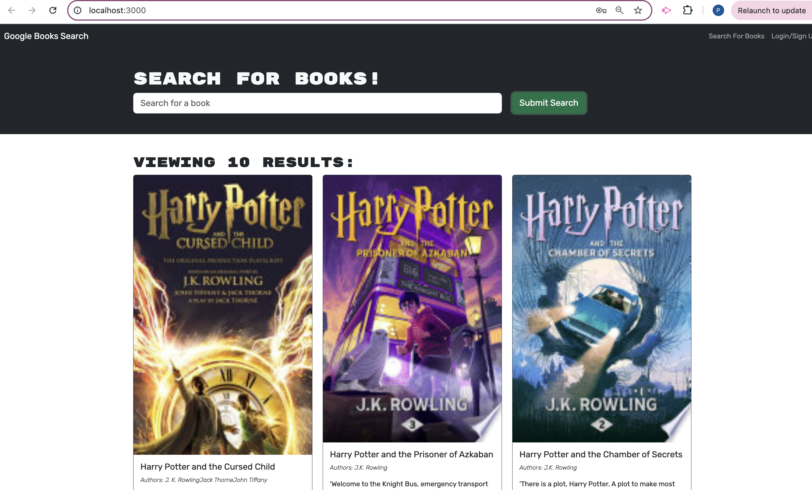
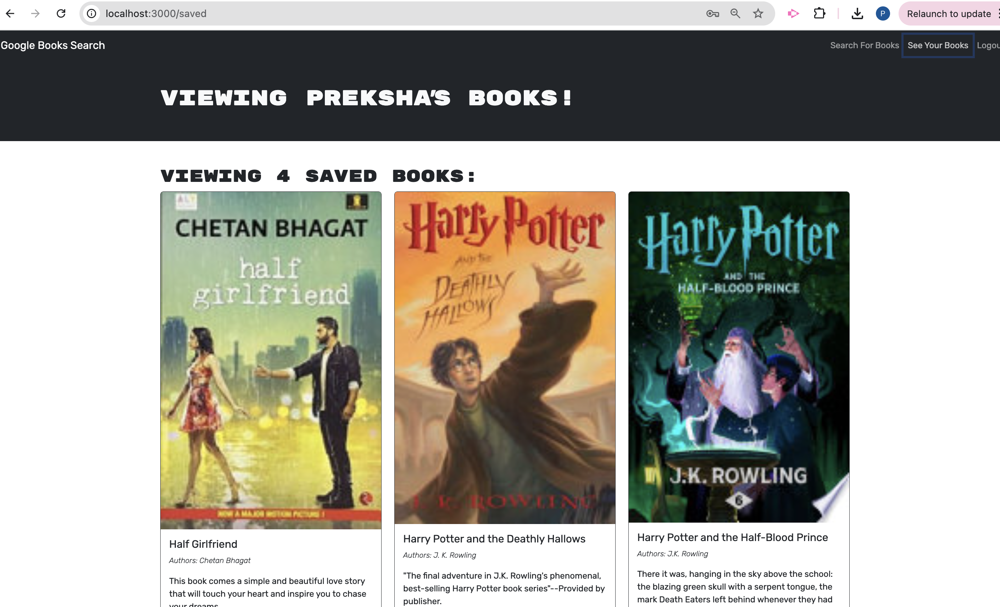

# Preksha-Book-Search-Engine

## Table of Contents

* [Description](#description)

* [Usage Instructions](#usage-instructions)

* [Installation](#installation)

* [Features](#features)

* [Screenshots](#screenshots)

* [Demo](#Demo)

* [Questions](#questions)

## Description 

Preksha-Book-Search-Engine is a powerful and user-friendly web application that allows users to search for books using the Google Books API. It provides a seamless experience for finding books by title, author, or keywords, and users can save their favorite books for later reference.

## Usage Instructions 

Usage Instructions
1. Open the application in your web browser.
2. Use the search bar to find books by entering a title, author, or keyword.
3. Browse the search results and click on a book to view more details.
4. Save your favorite books to your personal list for future reference.

## Installation 

Installation
To run this application locally, follow these steps:

1. Clone the repository: git clone https://github.com/Preksha2408/Preksha-Book-Search-Engine.git
2. Navigate to the project directory: cd Preksha-Book-Search-Engine
3. Install the necessary dependencies: npm install
4. Start the development server: npm run dev
5. Open your browser and visit http://localhost:3000 to view the app.

## Features

1. Search for Books: Easily search for books using the Google Books API.
2. Save Favorite Books: Save books to your personal list for quick access.
3. Responsive Design: The application is fully responsive and works on all devices.
4. User Authentication: Securely log in and manage your saved books.

## Screenshots

## Demo 

## Questions 

For questions or further information, please contact me:

* Email - [prek.ps37@gmail.com](prek.ps37@gmail.com)

* GitHub - [Preksha2408](https://github.com/Preksha2408/Preksha-Book-Search-Engine.git)

* Deployed link on render - [Render](https://preksha-book-search-engine.onrender.com)